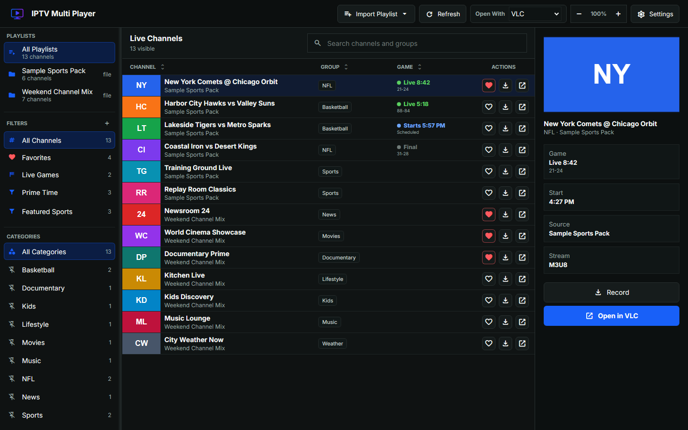

<p align="center">
  
</p>

# IPTV Multi Player

IPTV Multi Player is a local Windows desktop IPTV client for importing M3U playlists, browsing channels, and opening streams in GridPlayer, MPV, or VLC.

## Download

Download the latest Windows build from the [GitHub Releases page](https://github.com/jeremygold02/iptv-multi-player/releases/latest).

For most users, choose `IPTV Multi Player Setup.exe`. If you prefer a portable app, choose `IPTV Multi Player.exe`.

## Features

- Import local `.m3u`/`.m3u8` playlists or playlist URLs.
- Browse channels by playlist, category, favorites, search, and sortable columns.
- Pin categories and create custom filters for faster channel browsing.
- Choose GridPlayer, MPV, or VLC from the header before opening a stream.
- Build a stream queue and open the queued streams in your selected player.
- Configure external player executable paths and launch flags in Settings.
- Record streams and save clips when FFmpeg is available.
- Enrich sports-style channel titles with ESPN game status, with optional API-Sports fallback.
- Check GitHub releases for updates from the About dialog.

## Sports Data

ESPN scoreboard data is used first and does not require an API key. The app caches ESPN responses briefly so live games can refresh frequently without hammering endpoints.

API-Sports is optional fallback data for sports or matches ESPN does not cover. The app reads `API_SPORTS_KEY` from a local `.env` file beside `app.py`, or from the Settings screen.

```env
API_SPORTS_KEY=your_api_key_here
```

Imported playlists, cached API responses, favorites, settings, and other local runtime data are stored under `data/`.

## Development

Start the desktop app from a local checkout:

```powershell
python -m venv .venv
.\.venv\Scripts\python.exe -m pip install -r requirements.txt
.\.venv\Scripts\python.exe app.py
```

For browser/server mode:

```powershell
.\.venv\Scripts\python.exe app.py --server --port 7555
```

## Project Layout

- `app.py` starts the Flask server and pywebview desktop window.
- `iptv_multi_player/` contains the backend modules.
- `templates/` contains the HTML shell.
- `static/` contains frontend JavaScript and CSS.
- `docs/` contains README assets.
- `installer/` contains the Windows installer definition.
- `requirements.txt` lists Python runtime dependencies.
